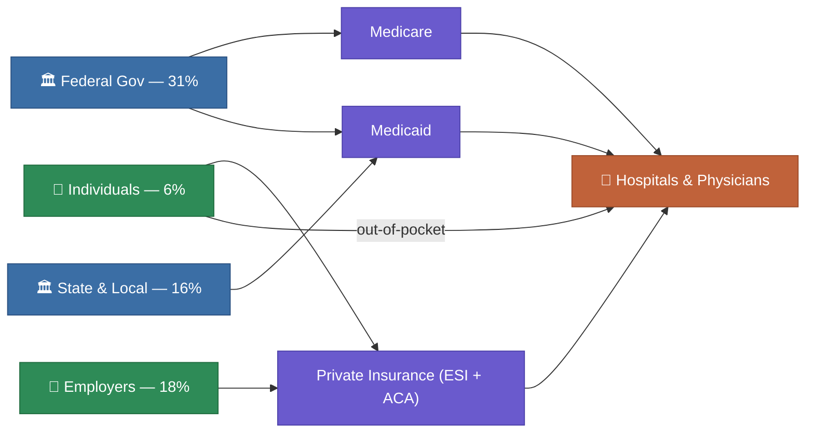

# U.S. Healthcare System — Overview

**Summary**: A high-level map of how the U.S. healthcare system is structured, who pays for care, and the major pressures shaping it in 2026.

**Sources**: `What to expect in US healthcare in 2026 and beyond.md`, `Eight Trends Shaping 2026 Healthcare Costs.md`, `Healthcare System Priorities in 2026.md`, `10 Healthcare Trends Reshaping the US Healthcare in 2026.md`

**Last updated**: 2026-05-12

---

## How the System Is Organized

The U.S. has no single national health system. Coverage comes from several parallel tracks:

- **[[employer-based-insurance|Employer-sponsored insurance (ESI)]]** — the dominant source, covering roughly 156 million Americans through their jobs or a family member's job
- **[[medicare|Medicare]]** — federal program for adults 65+, the disabled, and people with end-stage renal disease
- **[[medicaid|Medicaid]]** — joint federal-state program for low-income individuals meeting categorical requirements
- **[[affordable-care-act|ACA Marketplaces]]** — regulated exchanges where individuals and families without other coverage can buy subsidized plans; 25.2 million enrolled in early 2025
- **Uninsured** — approximately 26–28 million people as of 2024; projected to grow significantly due to [[obbba|OBBBA]] Medicaid cuts

Healthcare delivery itself is similarly fragmented: mostly private hospitals and physician practices operating under a mix of fee-for-service and emerging [[value-based-care|value-based contracts]].

## Who Pays

Healthcare now represents nearly **one in every five dollars** spent in the U.S. economy. Costs are shared across payers:

| Payer | Share of National Health Expenditure |
|---|---|
| Federal government | 31% |
| State & local government | 16% |
| Employers | 18% |
| Individuals (out-of-pocket) | 6% |
| Other private | ~29% |

(Source: CMS National Health Expenditure Data, cited in `Eight Trends Shaping 2026 Healthcare Costs.md`)

## Where the Money Goes

- **Hospitals**: ~40% of recent spending growth
- **Physician services**: large and growing share, especially specialty care
- **Pharmacy**: rising sharply — drug spending rose 11% in 2024, driven by [[pharmacy|GLP-1 therapies and specialty biologics]]
- **Post-acute and home care**: growing due to aging population

## The System in 2026 — Key Conditions

**Financial stress**: Industry EBITDA as a percentage of national health expenditure fell from 11.2% (2019) to 8.9% (2024) and is projected to reach 8.7% by 2027. Many large health systems operate on margins of 1–2%. (Source: McKinsey)

**Enrollment disruption**: The [[obbba|OBBBA]] (2025 budget reconciliation law) is expected to cause 9–10 million people to lose Medicaid coverage, and the expiration of enhanced ACA subsidies has already caused ACA Marketplace enrollment to fall by more than 1 million in 2026. The CBO estimates a total of ~10 million people will become uninsured as a result.

**Technology transformation**: [[ai-and-technology|Artificial intelligence]] is moving from pilot to operational deployment. 85% of healthcare organizations are pursuing gen AI initiatives; 10%+ of physicians are using AI ambient scribing tools.

**Workforce crisis**: Clinician burnout and staff shortages continue to be the most urgent operational challenge. More than half of clinicians report burnout symptoms. Healthcare systems are turning to AI and role redesign to compensate.

**Drug costs**: [[pharmacy|Prescription drug spending]] is rising sharply, with GLP-1 agonists alone accounting for half of 2024's 11% increase. U.S. drug costs remain roughly twice those of peer nations per capita.

**[[healthcare-consolidation|Market consolidation]]**: One or two health systems control all inpatient commercial hospital care in about half of U.S. metropolitan areas, raising prices and drawing regulatory scrutiny.

## Structural Tensions

The U.S. system is caught between several persistent tensions:
- **Coverage vs. cost**: Expanding access (ACA, Medicaid) while controlling spending
- **FFS vs. value-based**: Moving from volume-rewarding payment to outcome-based models
- **Hospital vs. ambulatory**: Shifting care to lower-cost outpatient settings while hospitals maintain expensive infrastructure
- **Public vs. private**: Recurring debate about the appropriate role of government in insurance

## Related Pages

- [[history]] — How the system developed from 1965 to today
- [[medicare]]
- [[medicaid]]
- [[affordable-care-act]]
- [[employer-based-insurance]]
- [[healthcare-costs]]
- [[obbba]]
- [[ai-and-technology]]
